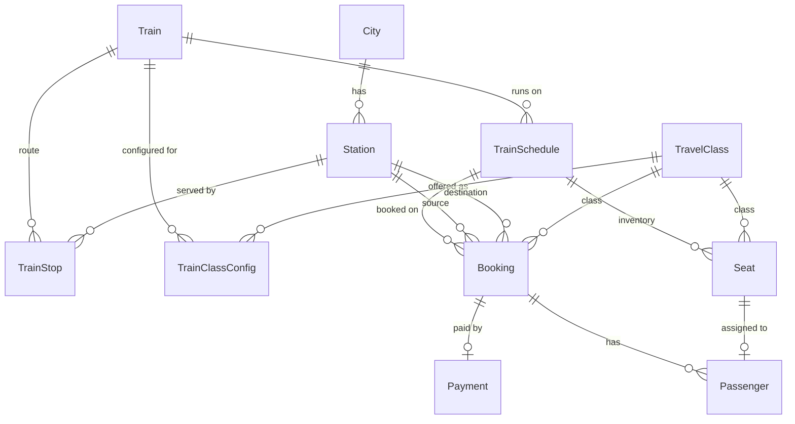
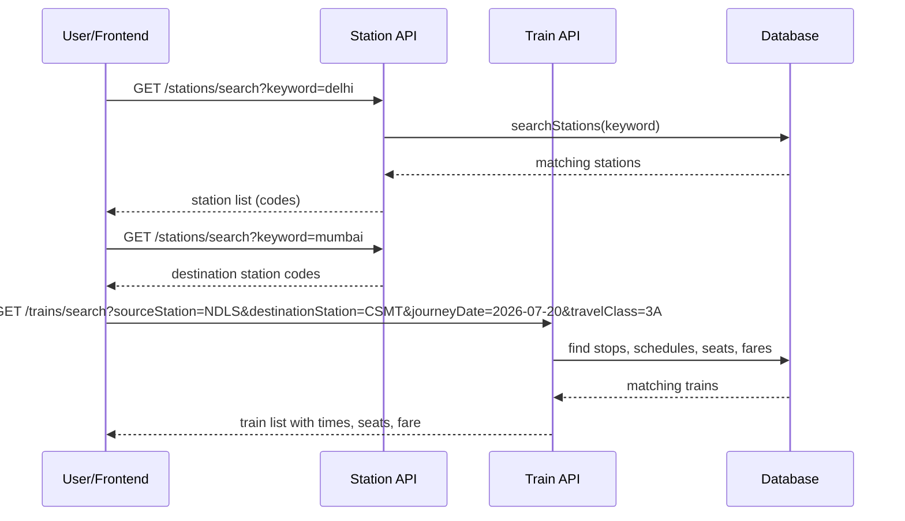
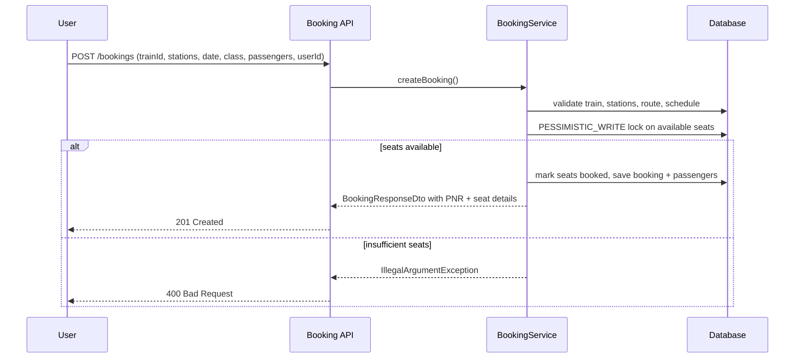
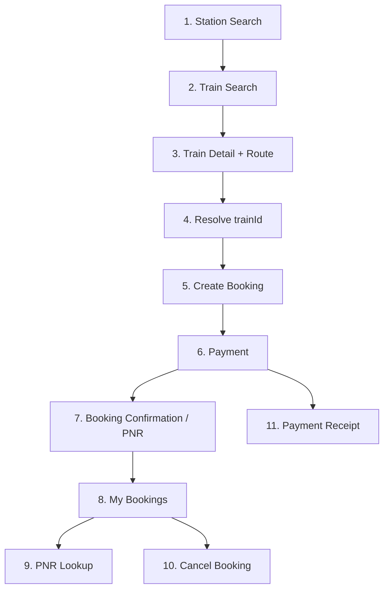

# Backend Analysis — Railway Booking System

> **Generated:** 2026-07-16  
> **Scope:** Complete inspection of the Spring Boot backend. No code was modified during this analysis.

---

## Table of Contents

1. [Project Architecture](#1-project-architecture)
2. [Folder Structure](#2-folder-structure)
3. [Database Design](#3-database-design)
4. [Entity Relationships](#4-entity-relationships)
5. [Repository Summary](#5-repository-summary)
6. [Service Summary](#6-service-summary)
7. [Controller Summary](#7-controller-summary)
8. [API Documentation](#8-api-documentation)
9. [DTO Documentation](#9-dto-documentation)
10. [Business Flow](#10-business-flow)
11. [Completed Features](#11-completed-features)
12. [Pending Features](#12-pending-features)
13. [Suggestions for Improvement](#13-suggestions-for-improvement)
14. [Recommended Frontend Screens](#14-recommended-frontend-screens)
15. [API Integration Order](#15-api-integration-order)

---

## 1. Project Architecture

### Overview

This is a **Railway Reservation System** built with:

| Layer | Technology |
|---|---|
| Framework | Spring Boot 3.5.4 |
| Language | Java 21 |
| Persistence | Spring Data JPA / Hibernate |
| Database | PostgreSQL (configured) |
| Validation | `spring-boot-starter-validation` (dependency present, **not used in controllers/DTOs**) |
| Boilerplate | Lombok |
| Build | Maven |

### Architectural Pattern

Classic **3-tier layered architecture**:

```
Controllers  →  Services (interface + impl)  →  Repositories  →  PostgreSQL
     ↓                    ↓
   DTOs              Entities
```

Additional cross-cutting concerns:

- **Global exception handling** via `@RestControllerAdvice`
- **Database seeding** via `ApplicationRunner` (`DatabaseSeeder`)
- **No security layer** (no Spring Security, no auth)
- **No configuration classes** (no CORS, no Swagger, no custom beans)

### Application Entry Point

- `BookingSystemApplication` — standard `@SpringBootApplication` bootstrap
- Server port: **8080**
- JPA `ddl-auto: update` (schema auto-managed by Hibernate)
- `show-sql: true` with formatted SQL

### Dependencies (pom.xml)

| Dependency | Purpose |
|---|---|
| spring-boot-starter-web | REST APIs |
| spring-boot-starter-data-jpa | ORM / repositories |
| spring-boot-starter-validation | Bean validation (unused) |
| mysql-connector-j | MySQL driver (unused — PostgreSQL is configured) |
| postgresql | Active DB driver |
| lombok | Code generation |
| spring-boot-starter-test | Testing |

**Note:** `spring-boot-starter-data-jpa` is declared **twice** in `pom.xml` (duplicate).

---

## 2. Folder Structure

```
booking-system/
├── pom.xml
├── mvnw / mvnw.cmd
├── .mvn/wrapper/
└── src/
    ├── main/
    │   ├── java/com/java/booking_system/
    │   │   ├── BookingSystemApplication.java
    │   │   ├── bootstrap/
    │   │   │   └── DatabaseSeeder.java
    │   │   ├── controllers/
    │   │   │   ├── StationController.java
    │   │   │   ├── TrainController.java
    │   │   │   ├── BookingController.java
    │   │   │   ├── PaymentController.java
    │   │   │   └── PnrController.java
    │   │   ├── services/
    │   │   │   ├── StationService.java / StationServiceImpl.java
    │   │   │   ├── TrainService.java / TrainServiceImpl.java
    │   │   │   ├── BookingService.java / BookingServiceImpl.java
    │   │   │   └── PaymentService.java / PaymentServiceImpl.java
    │   │   ├── repositories/          (11 JPA repositories)
    │   │   ├── entities/              (12 entities + 3 enums)
    │   │   ├── dtos/                  (9 DTO classes)
    │   │   └── exceptions/
    │   │       ├── ResourceNotFoundException.java
    │   │       └── GlobalExceptionHandler.java
    │   └── resources/
    │       └── application.yaml
    └── test/
        └── java/.../BookingSystemApplicationTests.java
```

### Not Present

- Configuration package (`@Configuration` classes)
- Utility/helper classes
- User/auth module
- `data.sql` / Flyway / Liquibase migrations
- OpenAPI/Swagger
- Dedicated mapper layer (MapStruct, etc.)

---

## 3. Database Design

All entities extend `BaseEntity`, which provides audit columns on every table:

| Column | Type | Notes |
|---|---|---|
| `created_at` | `TIMESTAMP` | Auto-set, not updatable |
| `updated_at` | `TIMESTAMP` | Auto-updated |

### 3.1 Table: `cities`

| Column | Type | Constraints |
|---|---|---|
| `id` | BIGINT | PK, auto-increment |
| `city_name` | VARCHAR(100) | NOT NULL, UNIQUE |
| `state` | VARCHAR(100) | NOT NULL |
| `country` | VARCHAR(100) | NOT NULL |
| `created_at` | TIMESTAMP | NOT NULL |
| `updated_at` | TIMESTAMP | |

**Business role:** Geographic lookup for stations.

---

### 3.2 Table: `stations`

| Column | Type | Constraints |
|---|---|---|
| `id` | BIGINT | PK |
| `station_code` | VARCHAR(10) | NOT NULL, UNIQUE |
| `station_name` | VARCHAR(150) | NOT NULL |
| `city_id` | BIGINT | FK → `cities.id`, NOT NULL |
| `platform_count` | INTEGER | nullable |
| `zone` | VARCHAR(100) | nullable |
| `latitude` | DOUBLE | nullable |
| `longitude` | DOUBLE | nullable |
| `created_at` / `updated_at` | TIMESTAMP | |

**Business role:** Boarding/alighting points. Referenced by train stops and bookings.

---

### 3.3 Table: `trains`

| Column | Type | Constraints |
|---|---|---|
| `id` | BIGINT | PK |
| `train_number` | VARCHAR(20) | NOT NULL, UNIQUE |
| `train_name` | VARCHAR(150) | NOT NULL |
| `train_type` | VARCHAR(50) | NOT NULL, enum: `TrainType` |
| `created_at` / `updated_at` | TIMESTAMP | |

**Enum `TrainType`:** `PASSENGER`, `EXPRESS`, `SUPERFAST`, `RAJDHANI`, `SHATABDI`, `GARIB_RATH`, `DURONTO`, `VANDE_BHARAT`

---

### 3.4 Table: `train_stops`

| Column | Type | Constraints |
|---|---|---|
| `id` | BIGINT | PK |
| `train_id` | BIGINT | FK → `trains.id`, NOT NULL |
| `station_id` | BIGINT | FK → `stations.id`, NOT NULL |
| `stop_sequence` | INTEGER | NOT NULL |
| `arrival_time` | TIME | nullable (null for origin) |
| `departure_time` | TIME | nullable (null for terminus) |
| `distance_from_source` | DOUBLE | nullable |
| `day_offset` | INTEGER | NOT NULL (0 = same day as origin departure) |
| `created_at` / `updated_at` | TIMESTAMP | |

**Unique constraints:**
- (`train_id`, `stop_sequence`)
- (`train_id`, `station_id`)

**Business role:** Defines the route, timing, and distance for fare/time calculations.

---

### 3.5 Table: `train_schedules`

| Column | Type | Constraints |
|---|---|---|
| `id` | BIGINT | PK |
| `train_id` | BIGINT | FK → `trains.id`, NOT NULL |
| `departure_date` | DATE | NOT NULL (origin departure date) |
| `status` | VARCHAR(50) | NOT NULL, enum: `ScheduleStatus` |
| `created_at` / `updated_at` | TIMESTAMP | |

**Unique constraint:** (`train_id`, `departure_date`)

**Enum `ScheduleStatus`:** `ON_TIME`, `DELAYED`, `CANCELLED`, `RESCHEDULED`

**Business role:** One running instance of a train on a specific origin departure date. Seats are tied to schedules.

---

### 3.6 Table: `travel_classes`

| Column | Type | Constraints |
|---|---|---|
| `id` | BIGINT | PK |
| `class_code` | VARCHAR(10) | NOT NULL, UNIQUE (e.g. `1A`, `2A`, `3A`) |
| `class_name` | VARCHAR(100) | NOT NULL |
| `description` | VARCHAR(300) | nullable |
| `created_at` / `updated_at` | TIMESTAMP | |

---

### 3.7 Table: `train_class_configs`

| Column | Type | Constraints |
|---|---|---|
| `id` | BIGINT | PK |
| `train_id` | BIGINT | FK → `trains.id` |
| `travel_class_id` | BIGINT | FK → `travel_classes.id` |
| `total_seats` | INTEGER | NOT NULL |
| `base_fare` | DOUBLE | NOT NULL |
| `created_at` / `updated_at` | TIMESTAMP | |

**Unique constraint:** (`train_id`, `travel_class_id`)

**Business role:** Per-train class capacity and base fare for pricing.

---

### 3.8 Table: `seats`

| Column | Type | Constraints |
|---|---|---|
| `id` | BIGINT | PK |
| `train_schedule_id` | BIGINT | FK → `train_schedules.id` |
| `travel_class_id` | BIGINT | FK → `travel_classes.id` |
| `carriage_number` | VARCHAR(10) | NOT NULL |
| `seat_number` | INTEGER | NOT NULL |
| `berth_type` | VARCHAR(50) | NOT NULL, enum: `BerthType` |
| `is_booked` | BOOLEAN | NOT NULL, default false |
| `created_at` / `updated_at` | TIMESTAMP | |

**Unique constraint:** (`train_schedule_id`, `travel_class_id`, `carriage_number`, `seat_number`)

**Enum `BerthType`:** `LOWER`, `MIDDLE`, `UPPER`, `SIDE_LOWER`, `SIDE_UPPER`

**Business role:** Physical inventory per schedule + class. Booked flag drives availability.

---

### 3.9 Table: `bookings`

| Column | Type | Constraints |
|---|---|---|
| `id` | BIGINT | PK |
| `train_schedule_id` | BIGINT | FK → `train_schedules.id` |
| `source_station_id` | BIGINT | FK → `stations.id` |
| `destination_station_id` | BIGINT | FK → `stations.id` |
| `pnr` | VARCHAR(10) | NOT NULL, UNIQUE |
| `booking_date` | TIMESTAMP | NOT NULL |
| `travel_class_id` | BIGINT | FK → `travel_classes.id` |
| `total_fare` | DOUBLE | NOT NULL |
| `status` | VARCHAR(20) | NOT NULL (`CONFIRMED` / `CANCELLED` — plain string, not enum) |
| `user_id` | BIGINT | NOT NULL (no FK — no `users` table) |
| `created_at` / `updated_at` | TIMESTAMP | |

---

### 3.10 Table: `passengers`

| Column | Type | Constraints |
|---|---|---|
| `id` | BIGINT | PK |
| `booking_id` | BIGINT | FK → `bookings.id` |
| `name` | VARCHAR(100) | NOT NULL |
| `age` | INTEGER | NOT NULL |
| `gender` | VARCHAR(10) | NOT NULL |
| `seat_id` | BIGINT | FK → `seats.id` |
| `created_at` / `updated_at` | TIMESTAMP | |

---

### 3.11 Table: `payments`

| Column | Type | Constraints |
|---|---|---|
| `id` | BIGINT | PK (internal) |
| `booking_id` | BIGINT | FK → `bookings.id`, One-to-One |
| `payment_id` | VARCHAR(100) | NOT NULL, UNIQUE (transaction ID) |
| `amount` | DOUBLE | NOT NULL |
| `payment_date` | TIMESTAMP | NOT NULL |
| `status` | VARCHAR(20) | NOT NULL (`SUCCESS` / `FAILED` — plain string) |
| `created_at` / `updated_at` | TIMESTAMP | |

---

### 3.12 Indexes

No explicit `@Index` annotations. Indexes are implied by:

- Primary keys on all `id` columns
- Unique constraints listed above
- Foreign key columns (DB-dependent auto-indexing)

**Recommended indexes (not present):** `bookings.user_id`, `bookings.pnr`, `seats.train_schedule_id + is_booked`, `train_stops.station_id`

---

### 3.13 Fare Calculation Logic

```
distance = destStop.distanceFromSource - srcStop.distanceFromSource
fareCoefficient = max(1.0, distance / 100.0)
singlePassengerFare = round(baseFare * fareCoefficient, 2)
totalFare = singlePassengerFare * passengerCount
```

Used in: `TrainServiceImpl.searchTrains()` and `BookingServiceImpl.createBooking()`.

---

### 3.14 Date / Time Logic

- `train_schedules.departure_date` = **origin** departure date (first stop, `day_offset = 0`).
- User-facing **journey date** = boarding date at source station.
- Conversion: `originDepartureDate = journeyDate - sourceStop.dayOffset`
- Arrival datetime accounts for `day_offset` difference between source and destination stops.

---

## 4. Entity Relationships



### Relationship Summary

| From | To | Cardinality | FK Column |
|---|---|---|---|
| Station | City | N:1 | `city_id` |
| TrainStop | Train | N:1 | `train_id` |
| TrainStop | Station | N:1 | `station_id` |
| TrainSchedule | Train | N:1 | `train_id` |
| TrainClassConfig | Train | N:1 | `train_id` |
| TrainClassConfig | TravelClass | N:1 | `travel_class_id` |
| Seat | TrainSchedule | N:1 | `train_schedule_id` |
| Seat | TravelClass | N:1 | `travel_class_id` |
| Booking | TrainSchedule | N:1 | `train_schedule_id` |
| Booking | Station (source) | N:1 | `source_station_id` |
| Booking | Station (dest) | N:1 | `destination_station_id` |
| Booking | TravelClass | N:1 | `travel_class_id` |
| Passenger | Booking | N:1 | `booking_id` |
| Passenger | Seat | N:1 | `seat_id` |
| Payment | Booking | 1:1 | `booking_id` |

---

## 5. Repository Summary

### 5.1 `CityRepository`

| Method | Type | Description |
|---|---|---|
| `findByCityName(String)` | Derived | Lookup city by name |
| `existsByCityName(String)` | Derived | Existence check |

**Usage:** Not used by any service/controller. Master data only.

---

### 5.2 `StationRepository`

| Method | Type | Description |
|---|---|---|
| `findByStationCode(String)` | Derived | Lookup by code (used in booking) |
| `findByCityId(Long)` | Derived | Stations in a city |
| `findByStationNameContainingIgnoreCase(String)` | Derived | Name search |
| `searchStations(String keyword)` | **Custom JPQL** | Search by station name, code, or city name (case-insensitive) |

**Usage:** `StationServiceImpl`, `BookingServiceImpl`

---

### 5.3 `TrainRepository`

| Method | Type | Description |
|---|---|---|
| `findByTrainNumber(String)` | Derived | Lookup by train number |

**Usage:** `TrainServiceImpl`, `BookingServiceImpl`, `DatabaseSeeder`, tests

---

### 5.4 `TrainStopRepository`

| Method | Type | Description |
|---|---|---|
| `findByTrainIdOrderByStopSequenceAsc(Long)` | Derived | Full route ordered |
| `findByStationStationCode(String)` | Derived | All stops at a station (train search) |
| `findByTrainIdAndStationId(Long, Long)` | Derived | Specific stop on a route |

**Usage:** `TrainServiceImpl`, `BookingServiceImpl`

---

### 5.5 `TrainScheduleRepository`

| Method | Type | Description |
|---|---|---|
| `findByTrainIdAndDepartureDate(Long, LocalDate)` | Derived | Schedule for origin departure date |

**Usage:** `TrainServiceImpl`, `BookingServiceImpl`, `DatabaseSeeder`, tests

---

### 5.6 `TrainClassConfigRepository`

| Method | Type | Description |
|---|---|---|
| `findByTrainId(Long)` | Derived | All class configs for a train |
| `findByTrainIdAndTravelClassClassCode(Long, String)` | Derived | Specific class config |

**Usage:** `TrainServiceImpl`, `BookingServiceImpl`, `DatabaseSeeder`

---

### 5.7 `TravelClassRepository`

| Method | Type | Description |
|---|---|---|
| `findByClassCode(String)` | Derived | Lookup by code |

**Usage:** `BookingServiceImpl`, `DatabaseSeeder`

---

### 5.8 `SeatRepository`

| Method | Type | Description |
|---|---|---|
| `findAvailableSeatsForUpdate(scheduleId, classCode)` | **Custom JPQL + PESSIMISTIC_WRITE lock** | Lock and fetch unbooked seats ordered by carriage, seat number |
| `countByTrainScheduleIdAndTravelClassClassCodeAndIsBookedFalse(...)` | Derived | Availability count |
| `findByTrainScheduleIdAndTravelClassClassCode(...)` | Derived | All seats for schedule+class |
| `findByTrainScheduleId(Long)` | Derived | All seats for schedule |

**Usage:** `TrainServiceImpl`, `BookingServiceImpl`, `DatabaseSeeder`, tests

**Critical:** Pessimistic write lock prevents double-booking under concurrency.

---

### 5.9 `BookingRepository`

| Method | Type | Description |
|---|---|---|
| `findByPnr(String)` | Derived | PNR lookup |
| `findByUserId(Long)` | Derived | User booking history |

**Usage:** `BookingServiceImpl`, `PaymentServiceImpl`, tests

---

### 5.10 `PassengerRepository`

| Method | Type | Description |
|---|---|---|
| `findByBookingId(Long)` | Derived | Passengers for a booking |

**Usage:** `BookingServiceImpl`, tests

---

### 5.11 `PaymentRepository`

| Method | Type | Description |
|---|---|---|
| `findByPaymentId(String)` | Derived | Lookup by transaction ID |

**Usage:** `PaymentServiceImpl`, tests

---

## 6. Service Summary

### 6.1 `StationService` / `StationServiceImpl`

**Responsibilities:**
- List all stations
- Get station by ID
- Search stations by keyword

**Business logic:** Minimal — delegates to repository, maps entity → `StationsResponseDto`.

**DTO mapping:** Includes `cityName` and `state` from lazy-loaded `City` relationship.

**Repositories:** `StationRepository`

**Risks:** Potential N+1 queries when listing all stations (lazy `city` fetch per station).

---

### 6.2 `TrainService` / `TrainServiceImpl`

**Responsibilities:**
- Search trains between two station codes on a journey date for a travel class
- Get train details by ID
- Get full train route (ordered stops)
- Get class-wise availability for a train on a date

**Search algorithm:**
1. Find all train stops at source station code
2. Find all train stops at destination station code
3. For matching train IDs where source sequence < destination sequence:
   - Compute origin departure date from journey date and day offset
   - Find schedule for that origin date
   - Find class config
   - Count available seats
   - Compute fare from distance
   - Build `TrainSearchResponseDto`

**Repositories:** `TrainRepository`, `TrainStopRepository`, `TrainScheduleRepository`, `TrainClassConfigRepository`, `SeatRepository`

**Known inconsistency:** `getTrainAvailability()` treats `journeyDate` as the **origin departure date**, while `searchTrains()` treats it as the **boarding date** at source station.

---

### 6.3 `BookingService` / `BookingServiceImpl`

**Responsibilities:**
- Create booking (seat allocation, PNR generation, passenger persistence)
- Get booking by ID
- Get bookings by user ID
- Cancel booking (release seats)
- Get booking by PNR

**Create booking flow:**
1. Validate train, stations, travel class exist
2. Validate source/dest are on train route and in correct order
3. Resolve schedule from journey date + day offset
4. Load class config for fare
5. **Pessimistic lock** available seats
6. Allocate first N seats (ordered by carriage, seat number)
7. Generate unique 10-digit numeric PNR
8. Calculate and persist booking as `CONFIRMED`
9. Persist passengers linked to seats
10. Return `BookingResponseDto`

**Cancel booking flow:**
1. Validate booking exists and is not already cancelled
2. Set all linked seats `isBooked = false`
3. Set booking status to `CANCELLED`

**Repositories:** All major repositories except `PaymentRepository` and `CityRepository`

**Transaction:** `@Transactional` on write operations; read-only on queries.

---

### 6.4 `PaymentService` / `PaymentServiceImpl`

**Responsibilities:**
- Process payment for a booking
- Get payment by transaction ID or internal numeric ID

**Process payment flow:**
1. Validate booking exists and is not cancelled
2. Generate transaction ID: `TXN` + 12-char UUID fragment
3. Amount = request amount OR booking total fare if null
4. Always sets status `SUCCESS` (mock gateway)
5. Persist and return `PaymentResponseDto`

**Repositories:** `BookingRepository`, `PaymentRepository`

**Gaps:** No amount validation against booking fare, no duplicate payment check, no link back to update booking payment status.

---

## 7. Controller Summary

| Controller | Base Path | Endpoints | Service |
|---|---|---|---|
| `StationController` | `/api/v1/stations` | 3 GET | `StationService` |
| `TrainController` | `/api/v1/trains` | 4 GET | `TrainService` |
| `BookingController` | `/api/v1/bookings` | 1 POST, 2 GET, 1 DELETE | `BookingService` |
| `PaymentController` | `/api/v1/payments` | 1 POST, 1 GET | `PaymentService` |
| `PnrController` | `/api/v1/pnr` | 1 GET | `BookingService` |

**Common patterns:**
- Constructor injection via `@RequiredArgsConstructor`
- No `@Valid` on request bodies
- No `@RequestParam` validation (required params not enforced via annotations)
- No pagination, filtering, or sorting on list endpoints
- No CORS configuration

---

## 8. API Documentation

### 8.1 Stations

#### `GET /api/v1/stations`

| Attribute | Value |
|---|---|
| **Purpose** | List all stations |
| **Request params** | None |
| **Path variables** | None |
| **Request body** | None |
| **Response** | `List<StationsResponseDto>` |
| **Validation** | None |
| **Tables** | `stations`, `cities` |

---

#### `GET /api/v1/stations/{id}`

| Attribute | Value |
|---|---|
| **Purpose** | Get single station by ID |
| **Path variables** | `id` (Long) |
| **Response** | `StationsResponseDto` |
| **Errors** | 404 if not found |
| **Tables** | `stations`, `cities` |

---

#### `GET /api/v1/stations/search?keyword={keyword}`

| Attribute | Value |
|---|---|
| **Purpose** | Search stations by name, code, or city |
| **Query params** | `keyword` (String, required) |
| **Response** | `List<StationsResponseDto>` |
| **Repository** | `StationRepository.searchStations()` |
| **Tables** | `stations`, `cities` |

---

### 8.2 Trains

#### `GET /api/v1/trains/search`

| Attribute | Value |
|---|---|
| **Purpose** | Search trains between source and destination on a date for a class |
| **Query params** | `sourceStation` (station code), `destinationStation` (station code), `journeyDate` (ISO date `yyyy-MM-dd`), `travelClass` (class code e.g. `3A`) |
| **Response** | `List<TrainSearchResponseDto>` |
| **Business logic** | Route matching, schedule resolution, seat count, distance-based fare |
| **Tables** | `train_stops`, `trains`, `train_schedules`, `train_class_configs`, `travel_classes`, `seats` |

**Response fields:** `trainNumber`, `trainName`, `departure`, `arrival`, `availableSeats`, `fare`

**Gap:** Does not return `trainId` — frontend must resolve train ID separately for booking.

---

#### `GET /api/v1/trains/{id}`

| Attribute | Value |
|---|---|
| **Purpose** | Get train metadata |
| **Path variables** | `id` (Long) |
| **Response** | `TrainResponseDto` |
| **Tables** | `trains` |

---

#### `GET /api/v1/trains/{id}/route`

| Attribute | Value |
|---|---|
| **Purpose** | Get ordered list of stops for a train |
| **Path variables** | `id` (Long) |
| **Response** | `TrainRouteResponseDto` |
| **Tables** | `trains`, `train_stops`, `stations` |

---

#### `GET /api/v1/trains/{id}/availability?journeyDate={date}`

| Attribute | Value |
|---|---|
| **Purpose** | Class-wise seat availability and base fare |
| **Path variables** | `id` (Long) |
| **Query params** | `journeyDate` (ISO date) — treated as **origin departure date** |
| **Response** | `List<AvailabilityResponseDto>` |
| **Tables** | `trains`, `train_schedules`, `train_class_configs`, `travel_classes`, `seats` |

---

### 8.3 Bookings

#### `POST /api/v1/bookings`

| Attribute | Value |
|---|---|
| **Purpose** | Create a new booking with automatic seat allocation |
| **Request body** | `BookingRequestDto` |
| **Response** | `BookingResponseDto` (201 Created) |
| **Validation** | Service-level only (no `@Valid`) |
| **Tables** | `trains`, `stations`, `travel_classes`, `train_stops`, `train_schedules`, `train_class_configs`, `seats`, `bookings`, `passengers` |

**Request body schema:**
```json
{
  "trainId": 1,
  "sourceStationCode": "NDLS",
  "destinationStationCode": "CSMT",
  "journeyDate": "2026-07-20",
  "travelClassCode": "3A",
  "userId": 1,
  "passengers": [
    { "name": "John Doe", "age": 30, "gender": "M" }
  ]
}
```

---

#### `GET /api/v1/bookings/{bookingId}`

| Attribute | Value |
|---|---|
| **Purpose** | Get booking details by internal ID |
| **Response** | `BookingResponseDto` |
| **Tables** | `bookings`, `passengers`, `seats`, related entities |

---

#### `GET /api/v1/bookings/user/{userId}`

| Attribute | Value |
|---|---|
| **Purpose** | List all bookings for a user |
| **Response** | `List<BookingResponseDto>` |
| **Tables** | `bookings`, `passengers`, `seats` |

---

#### `DELETE /api/v1/bookings/{bookingId}`

| Attribute | Value |
|---|---|
| **Purpose** | Cancel booking and release seats |
| **Response** | 204 No Content |
| **Errors** | 404 not found, 409 already cancelled |
| **Tables** | `bookings`, `passengers`, `seats` |

---

### 8.4 Payments

#### `POST /api/v1/payments`

| Attribute | Value |
|---|---|
| **Purpose** | Process payment for a booking (mock — always succeeds) |
| **Request body** | `PaymentRequestDto` |
| **Response** | `PaymentResponseDto` (201 Created) |
| **Tables** | `bookings`, `payments` |

**Request body:**
```json
{
  "bookingId": 1,
  "amount": 2760.00
}
```

---

#### `GET /api/v1/payments/{paymentId}`

| Attribute | Value |
|---|---|
| **Purpose** | Get payment by transaction ID or internal numeric ID |
| **Path variables** | `paymentId` (String) |
| **Response** | `PaymentResponseDto` |
| **Tables** | `payments`, `bookings` |

---

### 8.5 PNR

#### `GET /api/v1/pnr/{pnr}`

| Attribute | Value |
|---|---|
| **Purpose** | Look up booking by 10-digit PNR |
| **Path variables** | `pnr` (String) |
| **Response** | `BookingResponseDto` (same as booking detail) |
| **Tables** | `bookings`, `passengers`, `seats`, related entities |

---

### 8.6 Error Response Format

All handled exceptions return:

```json
{
  "timestamp": "2026-07-16T10:00:00",
  "status": 404,
  "error": "Not Found",
  "message": "Station not found with id: 99",
  "path": "/api/v1/stations/99"
}
```

| Exception | HTTP Status |
|---|---|
| `ResourceNotFoundException` | 404 |
| `IllegalArgumentException` | 400 |
| `IllegalStateException` | 409 |
| `Exception` (catch-all) | 500 |

**Missing handlers:** `MethodArgumentNotValidException`, `MethodArgumentTypeMismatchException`, `HttpMessageNotReadableException`

---

## 9. DTO Documentation

| DTO | Fields | Used By |
|---|---|---|
| `StationsResponseDto` | id, stationCode, stationName, cityName, state | Station APIs |
| `TrainSearchResponseDto` | trainNumber, trainName, departure, arrival, availableSeats, fare | Train search |
| `TrainResponseDto` | id, trainNumber, trainName, trainType | Train detail |
| `TrainRouteResponseDto` | trainNumber, trainName, stops[] (nested `StopDto`) | Train route |
| `TrainRouteResponseDto.StopDto` | stationCode, stationName, stopSequence, arrivalTime, departureTime, distanceFromSource, dayOffset | Nested in route |
| `AvailabilityResponseDto` | classCode, className, availableSeats, fare | Train availability |
| `BookingRequestDto` | trainId, sourceStationCode, destinationStationCode, journeyDate, travelClassCode, userId, passengers[] | Create booking |
| `BookingRequestDto.PassengerRequestDto` | name, age, gender | Nested in booking request |
| `BookingResponseDto` | bookingId, pnr, train info, stations, times, class, fare, dates, status, userId, passengers[] | Booking + PNR APIs |
| `BookingResponseDto.PassengerResponseDto` | name, age, gender, carriageNumber, seatNumber, berthType | Nested in booking response |
| `PaymentRequestDto` | bookingId, amount | Process payment |
| `PaymentResponseDto` | paymentId, bookingId, amount, paymentDate, status | Payment APIs |

**Note:** No dedicated error DTO class — errors use `Map<String, Object>`.

---

## 10. Business Flow

### 10.1 How a User Searches Trains



1. User searches and selects source/destination stations (by code).
2. User picks journey date and travel class.
3. Frontend calls train search API.
4. Backend finds trains whose route includes both stations in correct order, with a running schedule and available seats.
5. Results show departure/arrival datetimes, seat count, and per-passenger fare.

---

### 10.2 How Stations Are Searched

1. User types a keyword (city name, station name, or code).
2. `GET /api/v1/stations/search?keyword=...` runs a JPQL query across station name, station code, and city name (case-insensitive `LIKE`).
3. Results return id, code, name, city, and state for autocomplete UI.

Alternative: `GET /api/v1/stations` loads the full list (suitable only for small datasets).

---

### 10.3 How Bookings Happen



1. User selects a train (needs `trainId` — not returned by search API).
2. User enters passenger details (one per seat).
3. Booking is created immediately as **CONFIRMED** — no payment gate.
4. Seats are auto-allocated (first available, no user choice).
5. 10-digit PNR is generated.
6. Response includes full itinerary and seat/berth assignments.

---

### 10.4 How Payments Happen

1. After booking, user calls `POST /api/v1/payments` with `bookingId`.
2. Backend validates booking exists and is not cancelled.
3. Mock payment always succeeds with a generated `TXN...` ID.
4. Payment is stored independently — **booking status does not change**.
5. No refund flow on cancellation.

**Current model:** Booking and payment are decoupled. A booking can exist without payment, and payment does not gate confirmation.

---

### 10.5 How PNR Works

1. On booking creation, a unique 10-digit numeric PNR is generated.
2. Stored in `bookings.pnr` with a unique constraint.
3. `GET /api/v1/pnr/{pnr}` returns the same `BookingResponseDto` as booking detail.
4. PNR encodes no route/date information — it is a random lookup key.

---

### 10.6 Seat Allocation Plan

| Aspect | Implementation |
|---|---|
| Strategy | First-available (FIFO by carriage number, then seat number) |
| Concurrency | `PESSIMISTIC_WRITE` lock on seat query |
| User preference | Not supported (no berth type preference, no manual seat pick) |
| Segment awareness | Seats are booked for full schedule inventory — **no segment-level seat blocking** (a seat booked NDLS→CSMT is marked fully booked on that schedule) |
| Release on cancel | `isBooked` set back to `false` |

---

### 10.7 Database Seeding

`DatabaseSeeder` runs on startup if no trains exist:

- **Requires pre-existing** `stations` and `travel_classes` in DB (not seeded by this class)
- Creates train **12430** (Rajdhani NDLS → CSMT)
- Creates 2 stops, class configs for 1A/2A/3A (10 seats each)
- Generates schedules and seats for **30 days** starting 2026-07-16

If master data is missing, seeding is skipped with an error log.

---

## 11. Completed Features

| Feature | Status | Notes |
|---|---|---|
| Station listing | ✅ Complete | |
| Station search (autocomplete) | ✅ Complete | By name, code, city |
| Station detail by ID | ✅ Complete | |
| Train search | ✅ Complete | Route + schedule + availability + fare |
| Train detail | ✅ Complete | |
| Train route | ✅ Complete | Ordered stops |
| Train availability by class | ✅ Complete | Date semantics differ from search |
| Create booking | ✅ Complete | Auto seat allocation, PNR |
| Get booking by ID | ✅ Complete | |
| Get bookings by user | ✅ Complete | |
| Cancel booking | ✅ Complete | Releases seats |
| PNR lookup | ✅ Complete | |
| Process payment (mock) | ✅ Complete | Always SUCCESS |
| Get payment | ✅ Complete | By txn ID or internal ID |
| Global exception handling | ✅ Complete | 404, 400, 409, 500 |
| Concurrency-safe booking | ✅ Complete | Pessimistic lock + test |
| DB seeding (partial) | ✅ Complete | Train/schedules/seats only |
| Audit timestamps | ✅ Complete | Via `BaseEntity` |

---

## 12. Pending Features

| Feature | Priority | Notes |
|---|---|---|
| User registration / login | High | `userId` is a bare Long with no `users` table |
| Authentication & authorization | High | No Spring Security |
| Master data seeding (cities, stations, travel classes) | High | Required before `DatabaseSeeder` works |
| Travel class listing API | Medium | Frontend needs class dropdown |
| Return `trainId` in search results | Medium | Needed for booking flow |
| Payment-before-confirmation flow | Medium | Booking is CONFIRMED before payment |
| Payment amount validation | Medium | No check against `totalFare` |
| Duplicate payment prevention | Medium | Multiple payments per booking possible |
| Manual seat / berth selection | Low | Auto-allocation only |
| Segment-aware seat inventory | Low | Full-journey seat blocking |
| Refund on cancellation | Low | Not implemented |
| Waitlist / RAC | Low | Not in domain model |
| Admin APIs (CRUD trains, schedules) | Low | Read-only from API perspective |
| Pagination on list endpoints | Low | |
| CORS configuration | High (for frontend) | |
| OpenAPI / Swagger docs | Medium | |
| Input validation (`@Valid`, constraints) | High | Dependency unused |
| Booking/payment status enums | Low | Plain strings today |
| Email/SMS ticket delivery | Low | |
| Integration / API tests | Medium | Only context + concurrency test |
| Remove unused MySQL dependency | Low | Cleanup |
| Fix `journeyDate` semantics in availability API | Medium | Inconsistent with search/booking |

---

## 13. Suggestions for Improvement

### 13.1 Good Things

- **Clean layered architecture** — controllers, service interfaces, repositories are well separated.
- **DTO pattern** — entities are not exposed directly via APIs.
- **Pessimistic locking** for seat allocation — correct approach for concurrency; backed by an integration test.
- **Global exception handler** — consistent error JSON structure.
- **Database constraints** — unique PNR, unique seat per schedule, unique train+date schedule.
- **`BaseEntity` audit fields** — `createdAt` / `updatedAt` on all tables.
- **`@Transactional` boundaries** — properly applied on service methods.
- **Route validation** — booking verifies stations are on the train route in correct order.
- **Distance-based fare** — consistent formula in search and booking.
- **Day offset handling** — supports overnight/multi-day journeys.

### 13.2 Bad Things / Risks

- **No authentication** — any client can book/cancel with any `userId`.
- **Credentials in `application.yaml`** — database password committed in plain text.
- **Booking confirmed without payment** — business flow gap.
- **No input validation** — `@Valid` and constraint annotations absent despite dependency.
- **`journeyDate` semantics inconsistent** across train search vs availability API.
- **Train search missing `trainId`** — forces extra API call or train-number lookup.
- **N+1 query risk** — station list/search loads `City` lazily per station.
- **Status as plain strings** — `booking.status`, `payment.status` not type-safe enums.
- **`java.util.Random` for PNR** — not cryptographically secure (acceptable for demo, not production).
- **Catch-all `Exception` handler** — may leak internal error messages to clients.
- **No duplicate payment guard** — one booking can have multiple payment records (OneToOne constraint would fail on second insert, but error handling is unclear).
- **Master data not seeded** — app won't fully work on fresh DB without manual SQL.
- **Duplicate JPA dependency** in `pom.xml`.
- **Unused MySQL driver** in `pom.xml`.

### 13.3 Possible Improvements

| Area | Recommendation |
|---|---|
| Security | Add Spring Security + JWT; externalize secrets via env vars |
| Validation | Add `@NotNull`, `@NotBlank`, `@Min`, `@Valid` on DTOs and controller params |
| API consistency | Align `journeyDate` meaning; add `trainId` to search response |
| Performance | `@EntityGraph` or JOIN FETCH for station+city; add DB indexes |
| Payment flow | `PENDING` → `CONFIRMED` booking lifecycle; validate payment amount |
| Types | Replace status strings with enums; add `BookingStatus`, `PaymentStatus` |
| Docs | Add springdoc-openapi for auto-generated API docs |
| CORS | `@CrossOrigin` or `WebMvcConfigurer` for frontend dev |
| Seeding | Seed cities, stations, travel classes in `DatabaseSeeder` or `data.sql` |
| Testing | Add `@WebMvcTest` for controllers, repository tests, payment flow tests |
| PNR | Use `SecureRandom` or UUID-based shortened PNR |
| Pagination | `Pageable` on station list and user bookings |
| Mapper | Consider MapStruct for DTO mapping at scale |

### 13.4 Missing Validations

- Required request body fields (trainId, station codes, passengers, etc.)
- Passenger age range, gender format
- Journey date not in the past
- Travel class code format
- Payment amount matches booking total
- Schedule status not `CANCELLED` before booking
- Duplicate booking prevention

### 13.5 Missing Exception Handling

- `MethodArgumentNotValidException` (400 with field errors)
- `MethodArgumentTypeMismatchException` (invalid path/query types)
- `HttpMessageNotReadableException` (malformed JSON)
- `DataIntegrityViolationException` (duplicate PNR/payment race)
- `ConstraintViolationException`

### 13.6 Performance Improvements

- Eager fetch or batch fetch for `Station.city` in list endpoints
- Index on `train_stops.station_id`, `seats(train_schedule_id, is_booked)`
- Cache static master data (stations, travel classes)
- Avoid O(n²) nested loop in train search for large route networks (query-based join)

### 13.7 Security Improvements

- Authentication and authorization
- Rate limiting on booking endpoint
- Input sanitization
- Do not expose stack traces / internal messages (500 handler)
- HTTPS in production
- Idempotency keys for booking/payment

### 13.8 Naming Improvements

- `StationsResponseDto` → `StationResponseDto` (singular, one station per object)
- `isBooked` field → consider `booked` for JavaBean convention (Lombok handles `isBooked` specially)
- `Payment.paymentId` vs `Payment.id` — rename to `transactionId` to avoid confusion
- `journeyDate` → `boardingDate` for clarity

### 13.9 Folder Structure Improvements

```
config/          → CORS, OpenAPI, Security
constants/       → Status enums, error codes
mapper/          → DTO mappers
enums/           → Move BookingStatus, PaymentStatus out of entity package
seed/            → Separate seeders per domain
```

---

## 14. Recommended Frontend Screens

| # | Screen | APIs Used | Purpose |
|---|---|---|---|
| 1 | **Home / Search** | `GET /stations/search` | Source & destination autocomplete, date picker, class selector |
| 2 | **Search Results** | `GET /trains/search` | List trains with times, fare, availability |
| 3 | **Train Details** | `GET /trains/{id}`, `GET /trains/{id}/route` | Train info and full route map/timeline |
| 4 | **Class Availability** | `GET /trains/{id}/availability` | Per-class seat count (note date semantics) |
| 5 | **Passenger Details** | — (form only) | Collect name, age, gender per passenger |
| 6 | **Booking Review** | — | Summary before confirm |
| 7 | **Payment** | `POST /payments` | Pay for created booking |
| 8 | **Booking Confirmation** | `POST /bookings`, response | Show PNR, seats, itinerary |
| 9 | **My Bookings** | `GET /bookings/user/{userId}` | Booking history list |
| 10 | **Booking Detail** | `GET /bookings/{bookingId}` | Full ticket view |
| 11 | **PNR Status** | `GET /pnr/{pnr}` | Look up any ticket by PNR |
| 12 | **Cancel Booking** | `DELETE /bookings/{bookingId}` | Cancel with confirmation dialog |
| 13 | **Payment Receipt** | `GET /payments/{paymentId}` | Payment confirmation view |

---

## 15. API Integration Order

Recommended sequence for frontend development (each step builds on the previous):



| Step | API | Why This Order |
|---|---|---|
| 1 | `GET /api/v1/stations/search` | Entry point — station autocomplete |
| 2 | `GET /api/v1/trains/search` | Core search flow |
| 3 | `GET /api/v1/trains/{id}` + `/route` | Detail page enrichment |
| 4 | `GET /api/v1/trains/{id}` or lookup by train number | Search does not return `trainId` — resolve before booking |
| 5 | `POST /api/v1/bookings` | Core transaction |
| 6 | `POST /api/v1/payments` | Payment after booking |
| 7 | Display booking response / `GET /api/v1/pnr/{pnr}` | Confirmation screen |
| 8 | `GET /api/v1/bookings/user/{userId}` | User dashboard |
| 9 | `GET /api/v1/pnr/{pnr}` | Standalone PNR enquiry |
| 10 | `DELETE /api/v1/bookings/{bookingId}` | Cancellation flow |
| 11 | `GET /api/v1/payments/{paymentId}` | Receipt lookup |

### Frontend Prerequisites (Backend Gaps to Work Around)

1. **`userId`** — frontend must mock or hardcode until auth exists.
2. **`trainId`** — after search, call `GET /trains/{id}` using train number lookup or add backend fix.
3. **Travel classes** — hardcode `1A`, `2A`, `3A` or add a listing API.
4. **CORS** — backend needs CORS config before browser-based frontend can call APIs.
5. **Master data** — ensure DB has stations (NDLS, CSMT) and travel classes before testing.

---

## Appendix: Enum Reference

### `TrainType`
`PASSENGER`, `EXPRESS`, `SUPERFAST`, `RAJDHANI`, `SHATABDI`, `GARIB_RATH`, `DURONTO`, `VANDE_BHARAT`

### `ScheduleStatus`
`ON_TIME`, `DELAYED`, `CANCELLED`, `RESCHEDULED`

### `BerthType`
`LOWER`, `MIDDLE`, `UPPER`, `SIDE_LOWER`, `SIDE_UPPER`

### Booking Status (string, not enum)
`CONFIRMED`, `CANCELLED`

### Payment Status (string, not enum)
`SUCCESS`, `FAILED`

---

*End of backend analysis.*
